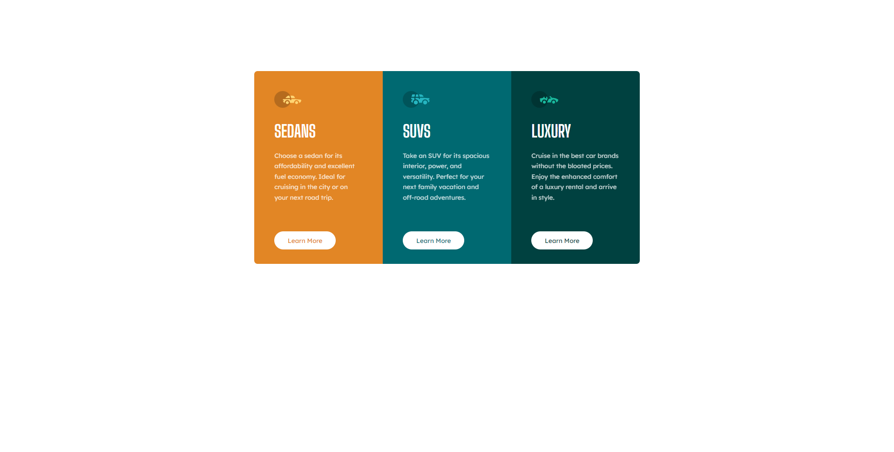

# Frontend Mentor - Body Mass Index Calculator solution

This is a solution to the [3-column preview card component challenge on Frontend Mentor](https://www.frontendmentor.io/challenges/3column-preview-card-component-pH92eAR2-). Frontend Mentor challenges help you improve your coding skills by building realistic projects. 

### Screenshot

### Links

- Solution URL: [https://www.frontendmentor.io/solutions/3column-component-with-css-grid-kiCurrkUAR](https://www.frontendmentor.io/solutions/3column-component-with-css-grid-kiCurrkUAR)
- Live Site URL: [https://umutyg.github.io/FrontendMentor-3Column-Preview-Card-/](https://umutyg.github.io/FrontendMentor-3Column-Preview-Card-/)

## Author

- Frontend Mentor - [@UmutYG](https://www.frontendmentor.io/profile/UmutYG)
